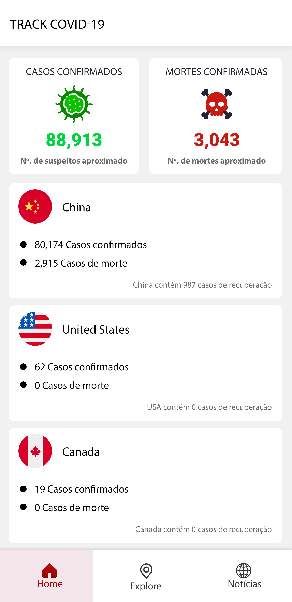
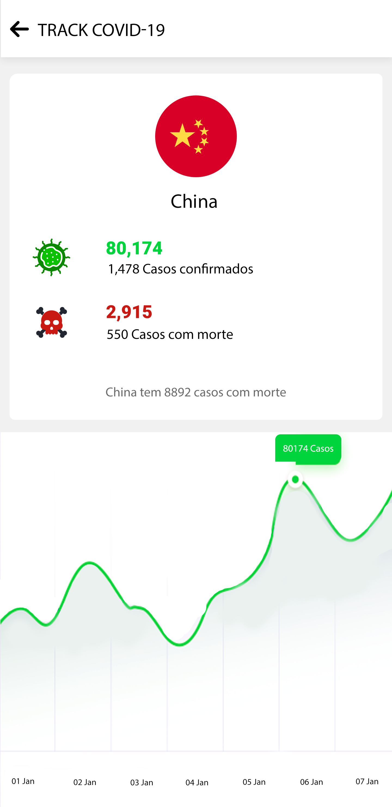
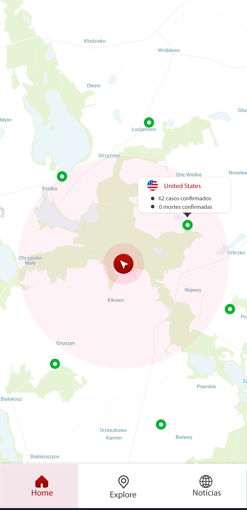
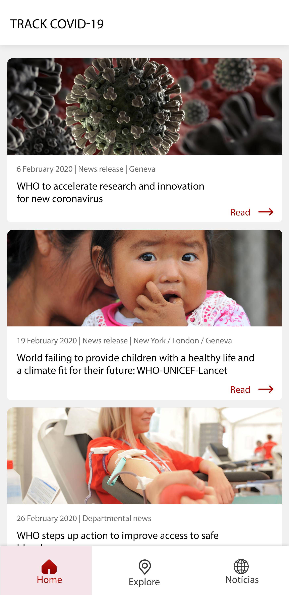

# Track Covid-19 App
## Descrição
Implementar um aplicativo do zero que irá funcionar como tracker do coronavírus. 

## Api 
Os dados do aplicativo serão todos obtidos por meio de uma open api. A documentação da api se encontra no link abaixo:  

[https://documenter.getpostman.com/view/10808728/SzS8rjbc?version=latest](https://documenter.getpostman.com/view/10808728/SzS8rjbc?version=latest)

**IMPORTANTE:** 
- Os dados fornecidos não são realtime. Alguns responses podem trazer dados de 1 dia atrás.
- Alguns países podem ter divergências e valores errados, devido a suspeitos de coronavirus falso-positivos.

## Direitos autorais
**ATENÇÃO:** O layout foi desenvolvido por terceiros e está sob licença para uso pessoal apenas. Ou seja, **NÃO** deve-se publicar o aplicativo em nenhuma loja. Todos os direitos reservados são do desenvolvedor no seguinte link:   
[https://www.uplabs.com/posts/2019-ncov-corona-virus-metrics-app-complete-ui-kit](https://www.uplabs.com/posts/2019-ncov-corona-virus-metrics-app-complete-ui-kit)

**IMPORTANTE:** O layout foi levemente alterado para suprir as necessidades da api. Porém, continua utilizando toda a base criado pelo terceiro citado acima. 

## Paleta de cores
As cores utilizadas devem ser: 
- Vermelho: #c81913
- Preto: #000000
- Branco: #ffffff
- Cinza Claro: #f1f1f1
- Verde: #00d43d

## Ícones
### Bandeira dos países
Todos as bandeiras de todos os países podem ser encontradas no repositório abaixo. Será necessário realizar o download da pasta png das regiões e mapear todas elas de acordo com as repostas da api.

[https://github.com/google/region-flags](https://github.com/google/region-flags)

### Demais ícones
Todos os demais ícones foram foram fornecidos e estão na pasta zipada junto com essa documentação.

## Descrição das telas do app
## Tela de SplashScreen
A tela inicial do app é responsável por mostrar o título do app com um background apenas durante 3 segundos.

### Fluxo de telas
Depois dos 3 segundos de exibição da splashcreen, o app deve ir para a tela de Home.

### Preview da tela SplashScreen
 

## Tela de Home
A tela principal do app é responsável por mostrar uma prévia da situação de todos os países disponíveis na api. 

### Fluxo de telas
Para chegar nessa tela é necessário ter clicado no menu home, que fica no canto inferior da tela. Essa tela é a principal do app.

### Endpoint
O endpoint a ser consumido (via GET) é: 

[https://api.covid19api.com/summary](https://api.covid19api.com/summary)

Dos dados provenientes da api, você irá utilizar: 
- Country (Nome do país)
- TotalConfirmed (Casos confirmados)
- TotalDeaths (Casos de morte)
- TotalRecovered (Casos de recuperação)

**IMPORTANTE** 
- Nos quadrados de CASOS CONFIRMADOS e MORTES CONFIRMADAS, você deverá realizar a soma de todas as mortes e casos confirmados de todos os países e exibir o resultado.

### Preview da tela Home 

### Fluxo de telas
- Ao clicar em qualquer país da lista, deve-se ir para a tela descrita abaixo (Gráfico).

## Tela de Gráfico
### Fluxo de telas
Para chegar nessa tela é necessário ter clicado em algum país da home. Para obter os dados dessa tela, você deve passar os dados de **nome do país, casos confirmados, casos de morte e casos de recuperação** da tela anterior. 

### Endpoint
Para obter os dados do gráfico, é necessário consumir o seguinte endpoint (via GET):

[https://api.covid19api.com/country/south-africa/status/confirmed/live](https://api.covid19api.com/country/south-africa/status/confirmed/live)

**IMPORTANTE:** Lembre-se de passar o nome do país ao chamar a url acima.

Dos dados provenientes da api, você irá utilizar: 
- Country (nome do país)
- Date (Data que teve a quantidade de casos)
- Cases (Casos confirmados naquele dia)
- Lat (Latitude)
- Lon (Longitude)

### Preview da tela Gráfico

## Tela de Explore
### Fluxo de telas
Para chegar nessa tela é necessário ter clicado no menu explore, que fica no canto inferior da tela. 

### Endpoint
Para obter os dados dessa tela, você deve consumir o seguinte endpoint (via GET):

[https://api.covid19api.com/summary](https://api.covid19api.com/summary)

**IMPORTANTE:** Para colocar os marcadores no mapa, será necessário vincular o nome do país a alguma coordenada geográfica. 

Dos dados provenientes da api, você irá utilizar: 
- Country (Nome do país)
- CountrySlug (key do país)
- TotalConfirmed (Casos confirmados)
- TotalDeaths (Casos com mortes)

### Preview da tela Explore

## Tela de Notícias 
### Fluxo de telas
Para chegar nessa tela é necessário ter clicado no menu notícias, que fica no canto inferior da tela. 
### API Key
As notícias sobre o coronavírus irão ser obtidas por outra API. O link da documentação da api é o seguinte: 

[https://newsapi.org/](https://newsapi.org/)

**IMPORTANTE:** Para utilizar essa API é necessário obter um API Key por meio do link: 

[https://newsapi.org/register](https://newsapi.org/register)

### Endpoint
Depois que tiver sua API Key em mãos, obtenha as notícias por meio do seguinte endpoint (via GET):

[http://newsapi.org/v2/everything?q=coronavirus&from=DATE&sortBy=publishedAt&apiKey=API_KEY](http://newsapi.org/v2/everything?q=coronavirus&from=DATE&sortBy=publishedAt&apiKey=API_KEY)

**IMPORTANTE:** Lembre-se de substituir DATE (data do dia no formato YYYY-MM-DD) e API_KEY por sua api key na url do serviço de notícias. Assim, você irá trazer todas as notícias daquele dia para o coronavírus.

### Preview da tela de notícias
